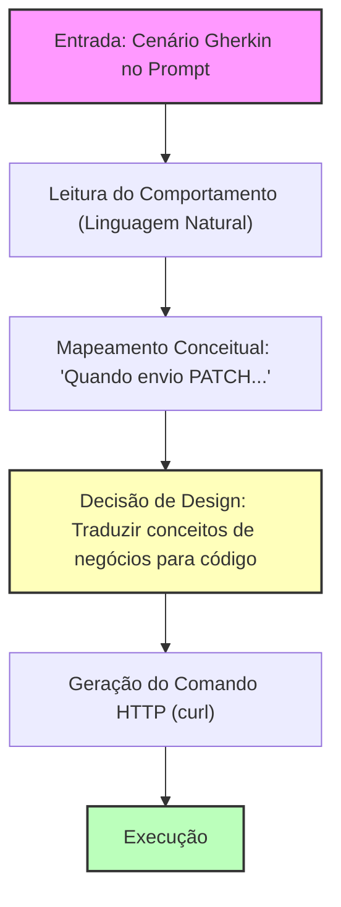
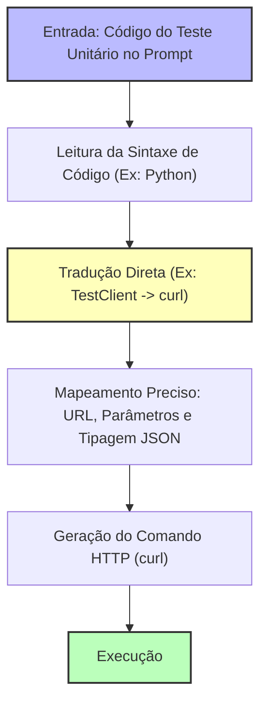

# Comparação: Gherkin vs Testes Unitários no Prompt

Esta documentação compara duas abordagens de **Few-Shot Prompting / In-Context Learning** para guiar agentes de IA na execução de requisições de API sem a necessidade de ler arquivos de implementação extensos.

---

## 1. Abordagem via Gherkin (Comportamental)

Esta abordagem usa especificações em linguagem natural estruturada (Dado/Quando/Então) para instruir o agente sobre o comportamento esperado da aplicação.

### Fluxo de Raciocínio (Gherkin)

* **Foco:** Regras de negócio, fluxos de uso e comportamento esperado.
* **Passos Cognitivos:** Requer que o agente faça uma "tradução interpretativa" de termos de negócio (*"solicitação número 4 está PENDING"*) para IDs de recursos (`vacation_id = 4`) e valores técnicos.

---

## 2. Abordagem via Teste Unitário (Estrutural)

Esta abordagem fornece um trecho de código de teste real (como um teste pytest com TestClient) demonstrando exatamente como a chamada HTTP é estruturada.

### Fluxo de Raciocínio (Teste Unitário)

* **Foco:** Contrato técnico, assinatura da API, cabeçalhos, tipagem e corpo do payload.
* **Passos Cognitivos:** O agente faz uma tradução direta baseada em sintaxe (sintaxe A para sintaxe B), reduzindo ambiguidades de interpretação de regras.

---

## Tabela Comparativa de Eficiência

| Critério | Abordagem Gherkin | Abordagem Teste Unitário |
| :--- | :--- | :--- |
| **Passos Cognitivos do LLM** | **Maior** (precisa inferir o contrato técnico a partir do texto). | **Menor** (o contrato técnico já está explícito no código). |
| **Consumo de Tokens** | Geralmente menor (texto Gherkin é compacto). | Ligeiramente maior (sintaxe de código possui mais caracteres). |
| **Precisão do Endpoint** | Média (depende da clareza do texto). | Altíssima (contém a string exata da URI e método). |
| **Precisão do Payload** | Média (pode faltar tipagem ou campos opcionais). | Altíssima (mostra o dicionário JSON exato). |
| **Indicação de Uso** | Melhor para treinar regras de fluxo complexas. | Melhor para execução rápida e precisa de comandos. |
