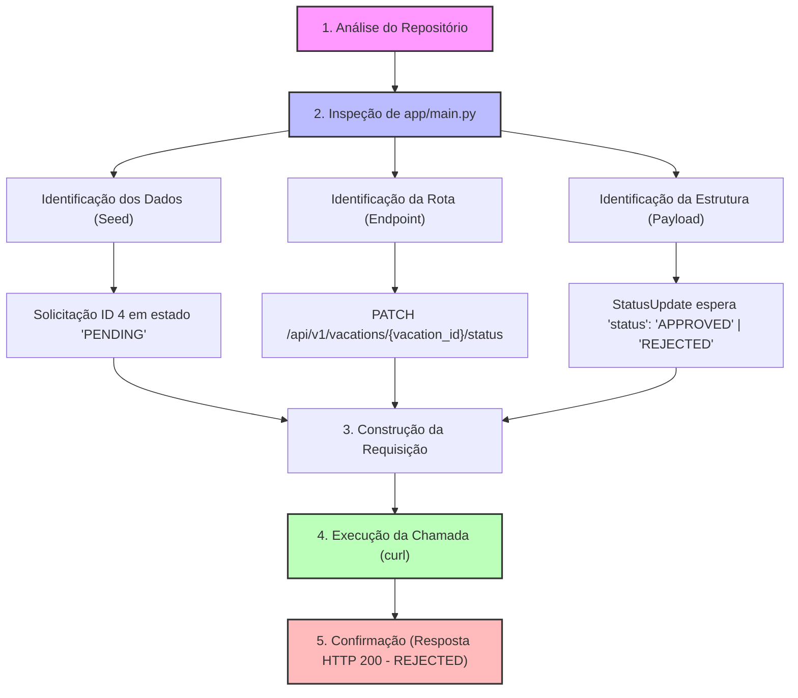

# Diagrama de Raciocínio

Este diagrama de fluxo demonstra os passos lógicos seguidos para analisar o repositório, descobrir o endpoint correto, mapear o payload necessário e executar a recusa da solicitação de férias de ID número 4.

